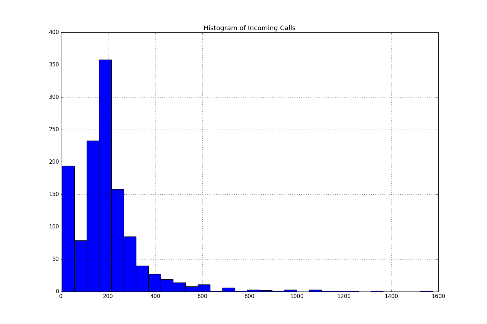
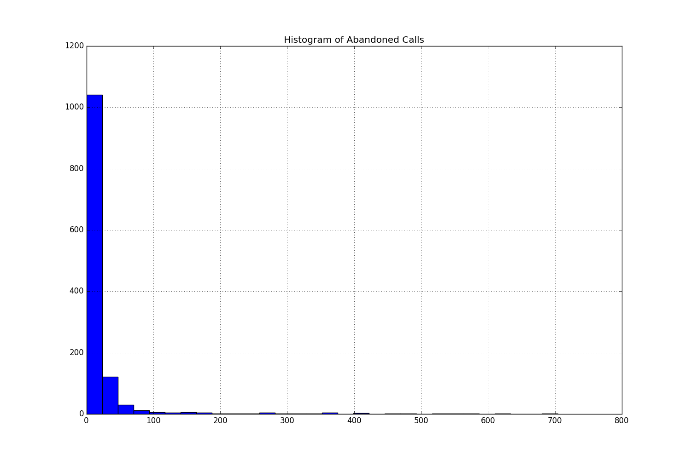
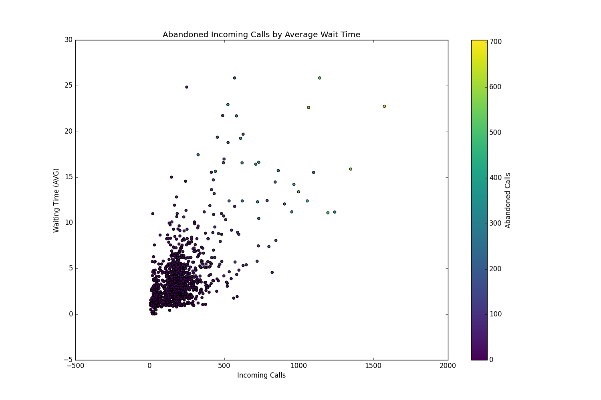
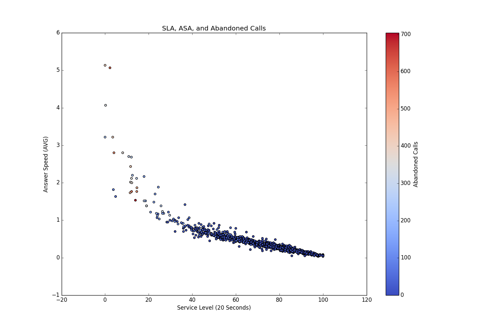
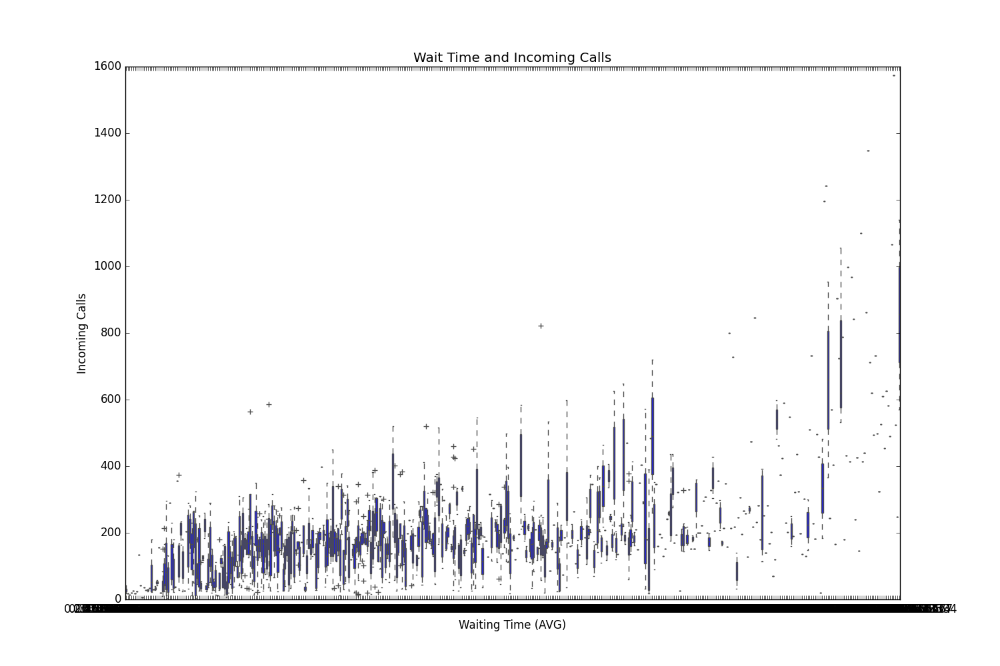
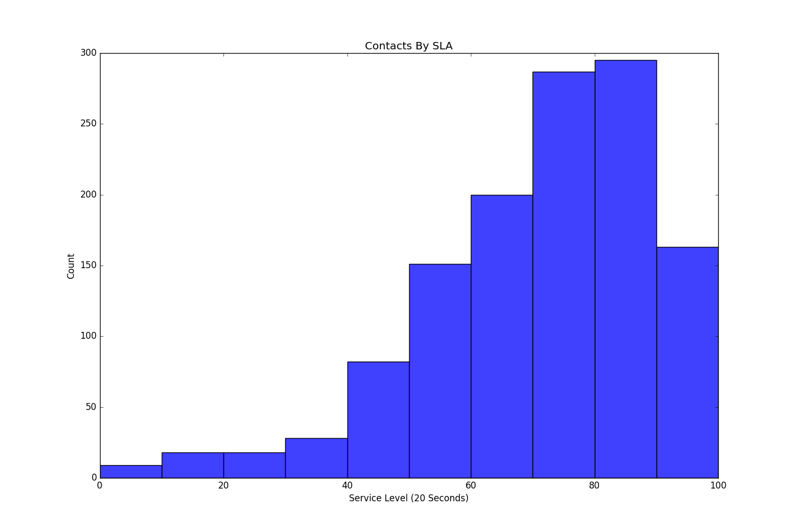
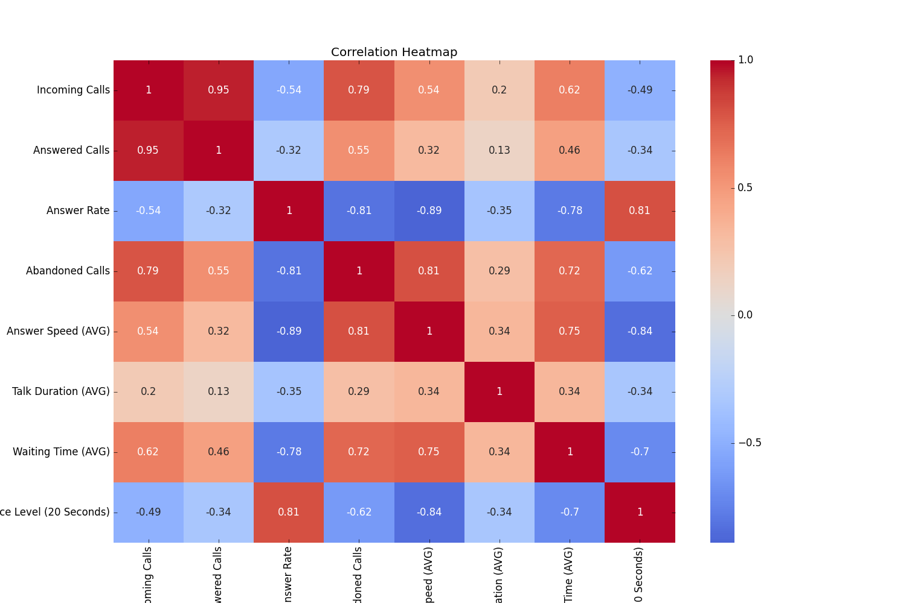
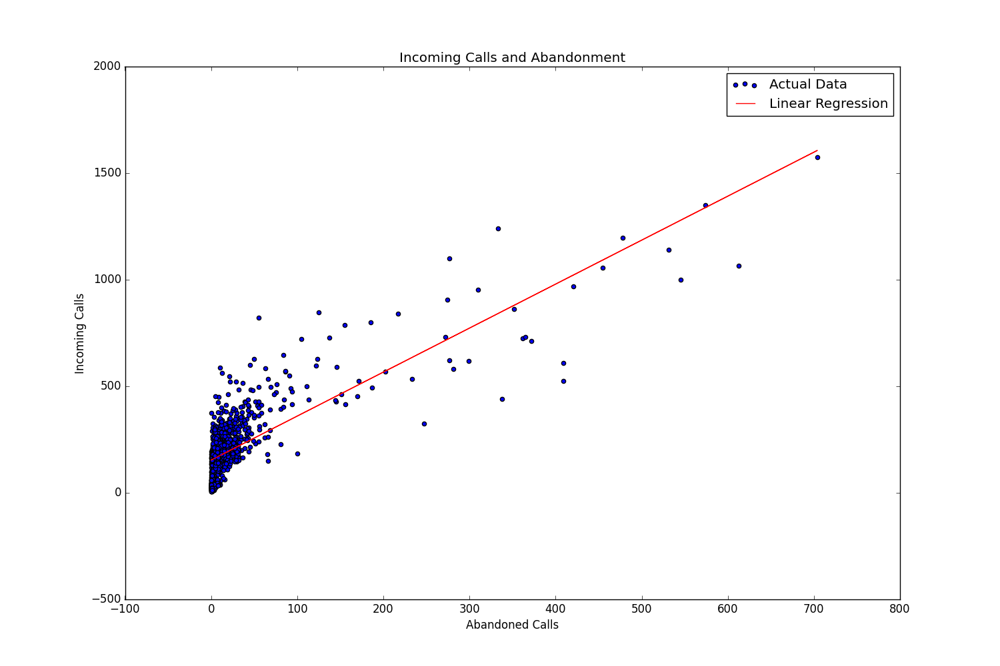
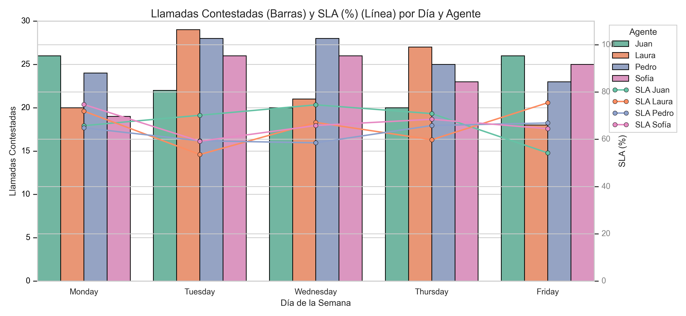

📊 Descripción del proyecto

Objetivo principal: Analizar métricas operativas (volumen de llamadas, tiempo de espera, tasa de abandono, nivel de servicio, etc.) para descubrir patrones, tendencias y oportunidades de mejora.

Preguntas de negocio:

¿En qué días u horas se concentra la mayor carga de llamadas?

¿Cuál es la velocidad promedio de atención y cómo se relaciona con la satisfacción del cliente?

¿Qué variables explican las llamadas abandonadas?

¿Podemos predecir picos de demanda para dimensionar el personal?

⚙️ Requisitos

Paquete

Versión sugerida

Python

3.10 o superior

pandas

>= 2.0

numpy

>= 1.26

matplotlib

>= 3.8

seaborn

>= 0.13

scikit‑learn

>= 1.5

jupyter

>= 1.0

Instala todo con:

pip install -r requirements.txt

🚀 Uso rápido

Clona el repositorio (o extrae el directorio CALL_CENTER en la raíz):

git clone https://github.com/LuisBuruato/Call-Center-Data-Analysis.git
cd Call-Center-Data-Analysis

Crea un entorno virtual (opcional pero recomendado):

python -m venv .venv
source .venv/Scripts/activate  # Windows

Instala dependencias: pip install -r requirements.txt

Ejecuta notebooks o scripts:

Análisis exploratorio: jupyter notebook notebooks/call_center_analysis.ipynb

Preprocesamiento completo: python src/preprocessing.py --input data/raw --output data/processed

Los gráficos y tablas de salida se guardarán en reports/figures.

📝 Resultados esperados

Dashboard con las principales KPIs (tiempo de atención, SLA, tasa de abandono).

Gráficos de estacionalidad diaria y semanal.

Modelos de predicción de volumen y dimensionamiento de agentes.

📌 Visualizaciones

Llamadas entrantes → Histograma

Llamadas abandonadas → Histograma

Llamadas entrantes vs espera y abandono → Scatter

SLA vs ASA y abandono → Scatter

Tiempo de espera vs volumen → Boxplot

Nivel de servicio (SLA) → Histograma

Mapa de calor de correlaciones

Abandono vs llamadas entrantes → Regresión

Contestadas + SLA por día/agente → Combinado

### 📈 Visualizaciones generadas

**1. Histograma de llamadas entrantes**

> Muestra la distribución de llamadas entrantes para entender la carga total del centro.

**2. Histograma de llamadas abandonadas**

> Evalúa la frecuencia de llamadas que no fueron atendidas por agentes.

**3. Diagrama de dispersión: llamadas entrantes vs tiempo de espera y abandono**

> Relaciona la cantidad de llamadas con el tiempo de espera y cuántas se abandonan.

**4. Diagrama de dispersión: SLA vs ASA y abandono**

> Mide cómo el nivel de servicio se correlaciona con el tiempo promedio de atención y la tasa de abandono.

**5. Boxplot: tiempo de espera según volumen de llamadas**

> Detecta valores atípicos y patrones en la relación entre espera y cantidad de llamadas.

**6. Histograma de nivel de servicio (SLA)**

> Visualiza la distribución del SLA para ver cuán frecuente se cumplen los objetivos de servicio.

**7. Mapa de calor de correlaciones entre variables**

> Muestra las correlaciones entre métricas clave como abandono, espera, nivel de servicio, etc.

**8. Regresión lineal: abandono vs llamadas entrantes**

> Explora si hay una relación lineal entre el volumen de llamadas y el abandono.

**9. Gráfico combinado: llamadas contestadas y SLA por día y agente**

> Este gráfico muestra cuántas llamadas contestó cada agente (barras) y su nivel de SLA (línea) durante la semana. Ayuda a comparar rendimiento y calidad al mismo tiempo.

Este gráfico muestra cuántas llamadas contestó cada agente (barras) y su nivel de SLA (línea) durante la semana. Ayuda a comparar rendimiento y calidad al mismo tiempo.

🤝 Contribuir

¡Las contribuciones son bienvenidas! Si deseas mejorar el análisis o añadir nuevas métricas:

Haz un fork del proyecto.

Crea una rama (git checkout -b feature/mi‑feature).

Confirma cambios y abre un pull request.
.

📄 Licencia

Este repositorio se distribuye bajo la licencia MIT. Consulta el archivo LICENSE para más detalles.

📧 Contacto

Autor: Luis Ramón Buruato

LinkedIn: https://www.linkedin.com/in/luis-buruato/
